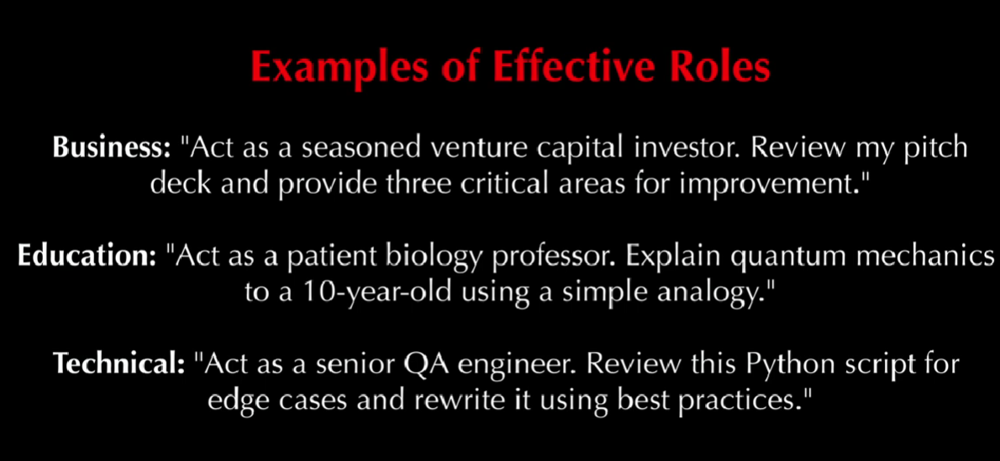
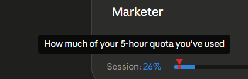
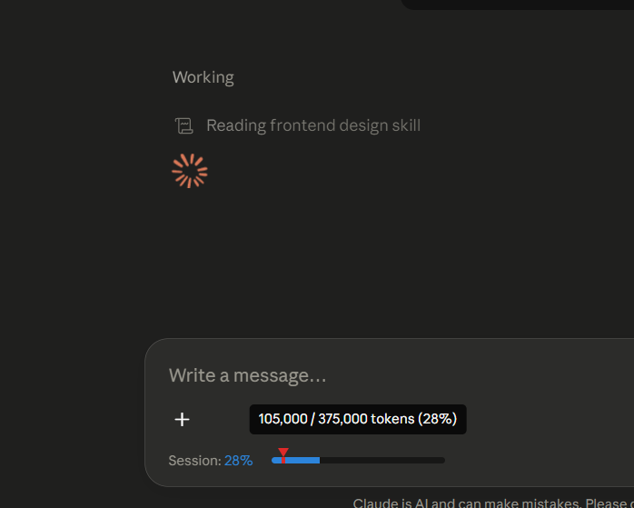

Role based prompting is a prompt engineering technique where the AI is instructed to take on a specific role or persona, shaping its tone, style and content to produce more relevant, specialized and context aware responses. 
The act of assigning a role to a Large Language Model (LLM) you’re prompting is called role prompting

Role based programming structure

Role Selection: Choose a role that best fits the task (e.g., teacher, financial advisor or developer) to guide the type of response.
Role Introduction: Clearly instruct the AI to assume that role so it understands the tone, style and perspective to follow.
Context Provision: Provide background or objectives to define the role’s scope and expectations.
Task Definition: Clearly state the question or task, ensuring the AI responds from the chosen role’s viewpoint.
Response Generation: The AI generates a response aligned with the role, using relevant knowledge, tone and style.
Iteration and Refinement: Improve results by modifying the prompt, adding more context or adjusting instructions if needed.

Role based prompting improves the quality of responses by guiding the AI to think and respond from a specific perspective, making outputs more useful and engaging and why you whould use it include:

1. Makes responses more clear, focused and relevant to the context.
2. Allows the AI to simulate expert roles for more specialized answers.
3 .Improves engagement by matching tone and style to the situation.
4. Supports creativity in tasks like storytelling or role based simulations.

eg. Write a quick outreach email to [person] about partnering up. , You are a salesperson. Write a quick outreach email to [person] about partnering up. etc.

What is Role-Based Prompting?
Role-Based Prompting means telling Claude who to be before asking it anything. Instead of just asking a question, you first assign Claude a professional identity — "Act as a senior software engineer" or "You are an experienced HR Manager" — and then ask your question.

Why It Matters
When you use Claude without a role, it answers as a general assistant. That's like asking a random stranger for medical advice versus asking a doctor. The information might be similar, but the framing, depth, vocabulary, and priorities are completely different.
Claude is trained on enormous amounts of professional knowledge. Role-Based Prompting is the key that unlocks the right layer of that knowledge for your specific need.

How Roles Change Response Quality
When you assign a role, Claude shifts its:

Vocabulary — uses domain-specific language
Priorities — focuses on what matters most in that field
Structure — formats answers the way professionals in that role actually think
Tone — matches the communication style of that profession

Example: Without a Role Prompt
Prompt: "How should I handle a conflict between two team members?"
Claude's response: "You should talk to both people separately, listen to their sides, find common ground, and encourage respectful communication."
→ Correct, but generic. Could apply to siblings, classmates, anyone.

Example: With a Role Prompt
Prompt: "Act as an experienced HR Manager. How should I handle a conflict between two team members?"
Claude's response: "As HR, I'd recommend starting with a structured one-on-one with each employee using active listening, documenting all exchanges for your records, checking if any company policy was violated, and scheduling a facilitated mediation session only after both parties feel individually heard. Be careful not to signal blame before the investigation is complete."
→ Precise. Professional. Actionable. Legally aware.

3 Practical Benefits
① Expert-level depth — You get responses that match real professional standards, not surface-level advice.
② Context-aware tone — Claude adapts its vocabulary, priorities, and format to fit the role, so answers feel genuinely crafted for your situation.
③ Fewer follow-up prompts — Because the first response is already focused and relevant, you spend less time asking Claude to "be more specific" or "think like a professional."
